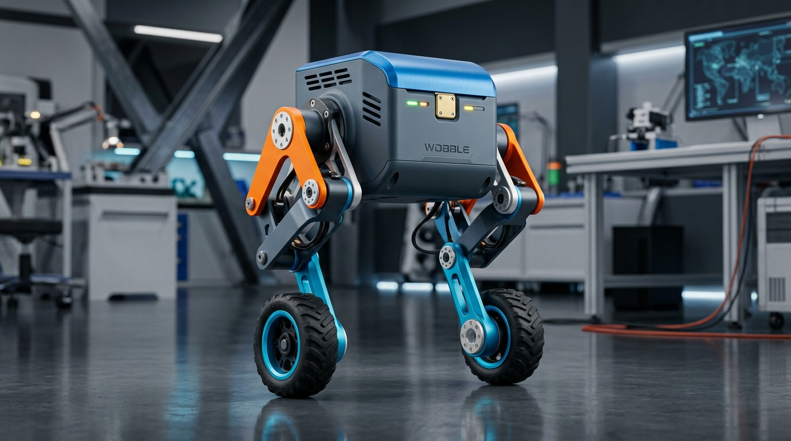

# Project Wobble: Dynamically Balancing Two-Wheeled Biped Robot

<p align="center">
  
</p>

Wobble is a dynamically balancing, two-wheeled bipedal robot designed to explore dynamic inverted pendulum stabilization combined with variable-height posture control via a 4-bar linkage.

---

## 1. System Architecture

* **Simulation Platform:** ROS 2 Jazzy & Gazebo Harmonic (via RoboStack / Pixi)
* **Physical Target Platform:** ESP32-S3 microcontroller + FreeRTOS
* **Posture Actuation:** 2x MG995 180° Servos controlling symmetric/differential 4-bar squat linkages ($[-\pi/2, +\pi/2]$ rad)
* **Balancing Actuation:** 2x DC Motors with high-resolution magnetic quadrature encoders
* **Sensing:** MPU6050 6-axis IMU (gyroscope + accelerometer) on torso center

---

## 2. Kinematic & Dynamic Design

### 4-Bar Squat Mechanism
Each leg consists of a planar 4-bar parallelogram linkage:
1. **Base Link:** Chassis hip mount.
2. **Crank Link:** Driven directly by the MG995 servo ($[-1.57, +1.57]$ rad).
3. **Coupler Link (Lower Leg):** Carries the wheel motor assembly, maintaining upright alignment as the leg squats.
4. **Passive Compliance:** Passively sprung shock-absorbing suspension between the lower leg and wheel hub to cushion impacts and eliminate continuous stall torque on the MG995 servos.

### Cascaded Balance Control Loop
The simulation uses a Cascaded PID architecture mirroring the physical ESP32-S3 firmware:
* **Outer Velocity Loop (50 Hz):** Tracks desired velocity $(v_{cmd}, \omega_{cmd})$ from `/cmd_vel` and calculates the lean angle offset $\theta_{target}$.
* **Inner Pitch Balance Loop (200 Hz):** Reads pitch angle $\theta$ and pitch angular velocity $\dot{\theta}$ from the MPU6050 `/imu/data` to compute balancing wheel torque $\tau_{bal}$.
* **Yaw Steering Loop (100 Hz):** Computes differential wheel torque $\Delta \tau$ for directional steering.
* **Fall Detection Watchdog:** Shuts down wheel motors if $|\theta| > 45^\circ$ to prevent motor runaway or hardware burnout.

---

## 3. Package Structure

```
Wobble/
├── pixi.toml                   # Non-root package manager (ROS 2 Jazzy + Gazebo Harmonic)
├── AGENT.md                    # Hardware & kinematic specification
├── src/
│   ├── wobble_description/     # URDF/Xacro models, materials, RViz visualizer
│   │   ├── urdf/
│   │   │   ├── wobble.urdf.xacro
│   │   │   ├── chassis.xacro
│   │   │   ├── leg_4bar.xacro
│   │   │   ├── wheels.xacro
│   │   │   ├── ros2_control.xacro
│   │   │   └── gazebo.xacro
│   │   ├── launch/display.launch.py
│   │   └── rviz/wobble.rviz
│   │
│   ├── wobble_control/         # Cascaded PID balance, posture, & remote controller
│   │   ├── wobble_control/balance_controller.py
│   │   ├── wobble_control/remote_control.py
│   │   ├── wobble_control/course_navigator.py
│   │   ├── config/controllers.yaml
│   │   ├── config/balance_params.yaml
│   │   └── launch/control.launch.py
│   │
│   ├── wobble_gazebo/          # Gazebo Harmonic world, bridge, and spawner
│   │   ├── worlds/wobble_hurdle_course.sdf
│   │   ├── config/ros_gz_bridge.yaml
│   │   └── launch/sim.launch.py
│   │
│   └── wobble_bringup/         # Master launch files
│       ├── launch/wobble_sim.launch.py
│       └── launch/hurdle_course.launch.py
```

---

## 4. Prerequisites & Installation

Project Wobble uses **[Pixi](https://pixi.sh/)** to manage the entire robotics software stack (ROS 2 Jazzy, Gazebo Harmonic 8.10, `ros2_control`, compilers, and graphics dependencies) inside an isolated, reproducible environment. **You do not need to install ROS 2 or Gazebo at the system level, and no `sudo` or root privileges are required.**

### 1. Install Git & Pixi

Before executing the project, install `pixi` on your system:

#### Linux & macOS:
```bash
curl -fsSL https://pixi.sh/install.sh | bash
```
*Restart your terminal or run `source ~/.bashrc` (or `~/.zshrc`) so `pixi` is available in your `PATH`.*

#### Alternative Package Managers:
* **Homebrew (macOS / Linux):**
  ```bash
  brew install pixi
  ```
* **Windows (PowerShell):**
  ```powershell
  iwr -useb https://pixi.sh/install.ps1 | iex
  ```
* **Conda / Mamba:**
  ```bash
  conda install -c conda-forge pixi
  ```

Verify the installation:
```bash
pixi --version
```

### 2. System Graphics Requirements (Linux)
Gazebo Harmonic and RViz2 require OpenGL / 3D hardware acceleration:
* On Ubuntu / Debian: `sudo apt install libgl1-mesa-dri mesa-utils` (or ensure GPU drivers are active).
* On Arch Linux: `sudo pacman -S mesa vulkan-radeon` (or `nvidia-utils` / `vulkan-intel`).

---

## 5. Quickstart Guide

### 1. Clone the Repository & Install Dependencies
```bash
git clone https://github.com/Fogyvishnu/Wobble.git
cd Wobble

# Automatically installs ROS 2 Jazzy, Gazebo Harmonic, compilers, and all dependencies
pixi install
```

### 2. Build the Workspace
Build all 4 ROS 2 packages using `colcon` inside the isolated Pixi environment:
```bash
pixi run build
```

### 3. Launch the Complete Simulation (Single Command)
Launch Gazebo Harmonic with the Hurdle Course, the robot spawner, ROS-Gazebo bridge, the Cascaded PID balance controller, the unified Remote Control GUI, and RViz2 all in one command:
```bash
pixi run sim
```

---

## 6. Remote Control & Navigation

When `pixi run sim` is executed, the **Wobble Remote Controller** window opens alongside Gazebo:

| Key | Action | Description |
|:---:|:---|:---|
| **`W`** | Forward | Drives the robot forward ($+v_x$) |
| **`S`** | Reverse | Drives the robot in reverse ($-v_x$) |
| **`A`** | Turn Left | Steers differential counter-clockwise ($+\omega_z$) |
| **`D`** | Turn Right | Steers differential clockwise ($-\omega_z$) |
| **`O`** | Squat | Flexes 4-bar MG995 servos to athletic crouch ($-0.42$ rad) to clear low hurdles |
| **`P`** | Stand | Returns 4-bar servos to neutral upright posture ($0.0$ rad) |
| **`Space`** | Emergency Brake | Instantly commands zero velocity with active pitch braking |
| **`R`** | Reset | Re-enables balance controller and recovers upright posture |

### Interactive Terminal CLI Mode
If you prefer running without a GUI or in an SSH / headless terminal session:
```bash
pixi run remote-cli
```

---

## 7. Useful Pixi Tasks Reference

| Command | Description |
|---|---|
| `pixi run build` | Builds all packages via `colcon build --symlink-install` |
| `pixi run sim` | Launches full GUI simulation (Gazebo + Balance + Remote Control + RViz) |
| `pixi run sim-headless` | Launches Gazebo in headless mode without GUI for automated testing or servers |
| `pixi run remote` | Launches the standalone PyQt5 remote control interface |
| `pixi run remote-cli` | Launches the terminal keyboard remote control interface |
| `pixi run display` | Launches RViz2 with interactive joint GUI sliders for kinematic inspection |
| `pixi run check-urdf` | Validates URDF/Xacro kinematic tree and link inertial definitions |
| `pixi run squat` | Quick topic command to trigger squat posture ($-0.42$ rad) |
| `pixi run stand` | Quick topic command to trigger upright posture ($0.0$ rad) |

---

## 8. Tuning & Sim-to-Real Transfer

* Controller tuning parameters can be modified in `src/wobble_control/config/balance_params.yaml`.
* The pitch, velocity, and yaw loop formulations are structured to be directly ported into the C++/ESP-IDF firmware for the physical ESP32-S3 microcontroller.
